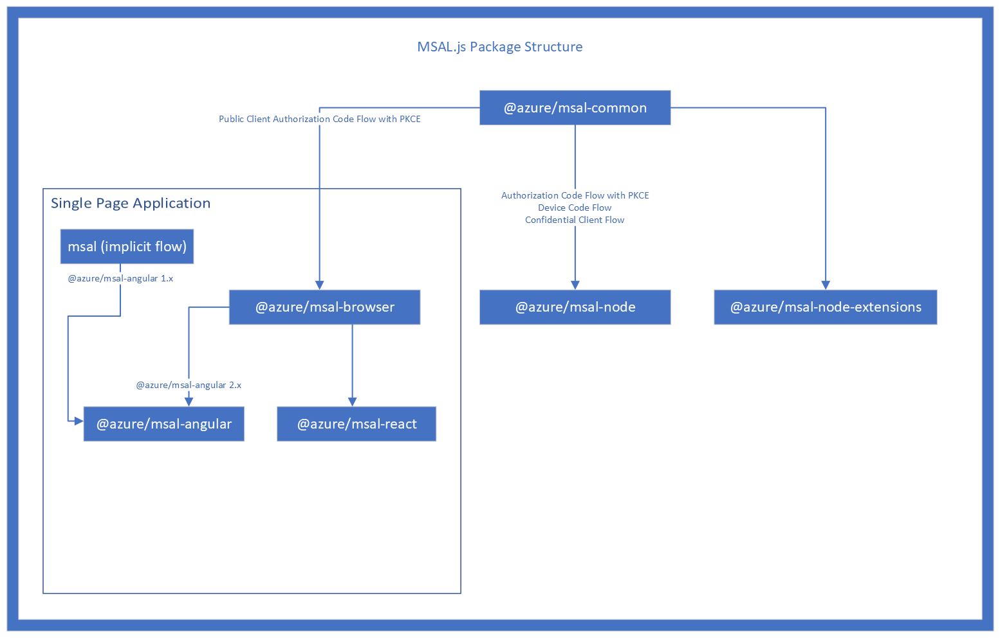

# Microsoft Authentication Library for JavaScript (MSAL.js)

The Microsoft Authentication Library for JavaScript enables both client-side and server-side JavaScript applications to authenticate users using [Microsoft Entra ID](/../../azure/active-directory/develop/v2-overview) for work and school accounts, Microsoft personal accounts (MSA), and social identity providers like Facebook, Google, LinkedIn, Microsoft accounts, etc. through [Azure AD B2C](/../../azure/active-directory-b2c/active-directory-b2c-overview#identity-providers) service. It also enables your app to get tokens to access [Microsoft Cloud](https://www.microsoft.com/enterprise) services such as [Microsoft Graph](https://graph.microsoft.io).

## Core and wrapper libraries

The [`lib`](https://github.com/AzureAD/microsoft-authentication-library-for-js/tree/dev/lib) folder contains the source code for our libraries in active development. You will also find all the details about **installing the libraries** in their respective README.md files.

- **Microsoft Authentication Library for Node.js v1.x:** A [Node.js](https://nodejs.org/en/) library that enables authentication and token acquisition with the Microsoft identity platform in JavaScript applications. Implements the following OAuth 2.0 protocols and is [OpenID-compliant](/../../azure/active-directory/develop/v2-protocols-oidc):
  - [Authorization Code Grant](https://oauth.net/2/grant-types/authorization-code/) with [PKCE](https://oauth.net/2/pkce/)
  - [Device Code Grant](https://oauth.net/2/grant-types/device-code/)
  - [Refresh Token Grant](https://oauth.net/2/grant-types/refresh-token/)
  - [Client Credential Grant](https://oauth.net/2/grant-types/client-credentials/)

- **Microsoft Authentication Library for JavaScript v2.x**: A browser-based, framework-agnostic browser library that enables authentication and token acquisition with the Microsoft identity platform in JavaScript applications. Implements the OAuth 2.0 [Authorization Code Flow with PKCE](/../../azure/active-directory/develop/v2-oauth2-auth-code-flow), and is [OpenID-compliant](/../../azure/active-directory/develop/v2-protocols-oidc).

- **Microsoft Authentication Library for React v1.x**: A wrapper of the `msal-browser` 2.x library for apps using React.

- **Microsoft Authentication Library for Angular v2.x**: A wrapper of the `msal-browser` 2.x library for apps using Angular framework.

- **Microsoft Authentication Library for JavaScript v1.x**: A browser-based, framework-agnostic core library that enables authentication and token acquisition with the Microsoft identity platform in JavaScript applications. It implements the OAuth 2.0 [Implicit Grant Flow](/../../azure/active-directory/develop/v2-oauth2-implicit-grant-flow), and is [OpenID-compliant](/../../azure/active-directory/develop/v2-protocols-oidc). Microsoft recommends using MSAL.js v2.0+ to take advantage of the authorization code flow with PKCE which is more secure.

- [Microsoft Authentication Library for Angular](https://github.com/AzureAD/microsoft-authentication-library-for-js/tree/msal-angular-v1/lib/msal-angular): A wrapper of the core 1.x library for apps using Angular framework.

## Package structure

There are a number of different packages meant for different platforms. You can see the relationship between packages and different authentication flows they implement in the package structure below.

## Samples

The [`code samples`](https://github.com/AzureAD/microsoft-authentication-library-for-js/tree/dev/samples) demonstrate usage of the Microsoft authentication libraries for JavaScript with the identity platform. Each code sample includes a `README.md` file describing how to build the project (if applicable) and run the sample application. 

For a complete list of samples targeting JavaScript and other languages, frameworks, and platforms, please refer to the [Microsoft identity platform code samples](/../../azure/active-directory/develop/sample-v2-code).

## Package versioning

All of our libraries follow [semantic versioning](https://semver.org). We recommend using the latest version of each library to ensure you have the latest security patches and bug fixes.

## Community help and support

- [FAQs](https://github.com/AzureAD/microsoft-authentication-library-for-js/wiki/FAQs) for access to our frequently asked questions.

- [Stack Overflow](http://stackoverflow.com/questions/tagged/msal) using "MSAL" and "msal.js" tag.

## Security reporting

If you find a security issue with our libraries or services [please report it to the Microsoft Security Response Center (MSRC)](https://aka.ms/report-security-issue) with as much detail as possible. 